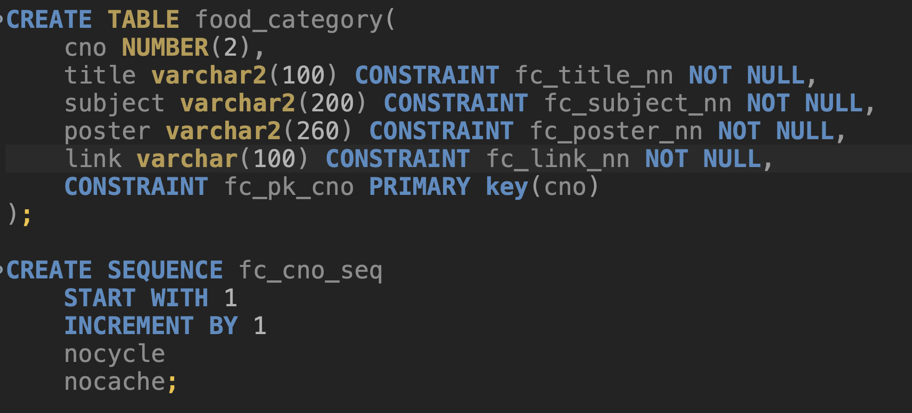
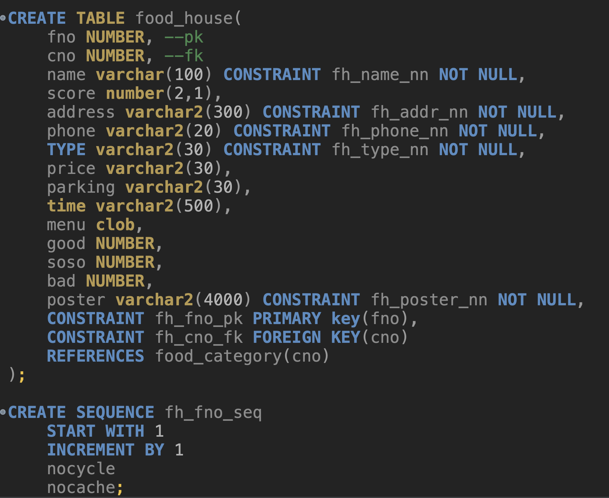

# 크롤링
망고플레이트 사이트를 크롤링하여 데이터 수집

### 맛집 카테고리별 데이터

데이터 베이스 설계

* 카테고리 번호 : cno primary key + sequence 자동증가번호 설정

* 카테고리 title  not null
* 상세설명 subject not null
* 음식사진 데이터 poster not null
* 카테고리 내부 상세 링크 link not null

 
 

### 카테고리 내부 맛집 리스트 데이터

* 맛집번호 fno primary key + sequence
* 카테고리번호 cno foreign key
* 음식점 이름  name not null
* 평점 score 
* 주소 address not null
* 전화번호 phone not null
* 판매음식 종류 type not null
* 가격대 price
* 주차 정보 parking
* 시간 time
* 메뉴 menu
* 사진 poster not null

